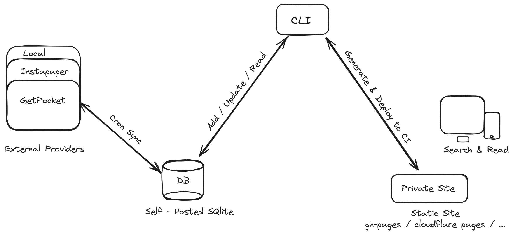

<h1 align="center">Research Pocket 🔖</h1>
<div align="center">
  <strong>
    The <em>last</em> save-it-later tool you'll ever need
  </strong>
</div>
<br />
<div align="center">
  <!-- Github Actions -->
  <a href="https://github.com/korigamik/ResearchPocket/actions/workflows/cargo-release.yml?query=branch%3Amain">
    </a>
  <!-- Version -->
  <a href="https://crates.io/crates/research">
    
  </a>
  <!-- Docs -->
  <a href="https://docs.rs/research">
      
  </a>
  <!-- Downloads -->
  <a href="https://crates.io/crates/research">
    
  </a>
</div>

<br/>

A self-hostable save-it-later tool that integrates with
[getpocket.com](https://getpocket.com) (and others soon). works on the web and
terminal

## How it works

<picture>
  <source media="(prefers-color-scheme: dark)" srcset="./.github/explainer-dark.png">
  <source media="(prefers-color-scheme: light)" srcset="./.github/explainer.png">
  
</picture>

## Installation

- Get the latest release binary for your desktop through the
  [releases page](https://github.com/KorigamiK/ResearchPocket/releases)

- Using Cargo
  ```sh
  $ cargo install research
  ```

## Generate your site

This requires that you have
[tailwindcss](https://tailwindcss.com/blog/standalone-cli) installed and
available in your `$PATH`

```sh
$ research init # initializes the database
$ research pocket auth # authenticate with pocket
$ research fetch # fetches your articles
$ # add --download-tailwind if you don't have tailwindcss installed in your $PATH
$ research --db ./research.sqlite generate . # generate your site
```

## Cli help

- Basic Help

  ```sh
  RESEARCH 🔖

  Manage your reading lists and generate a static site with your saved articles.

  Usage: research [OPTIONS] [COMMAND]

  Commands:
    pocket    Pocket related actions
    fetch     Gets all data from authenticated providers
    list      Lists all items in the database
    init      Initializes the database
    generate  Generate a static site
    help      Print this message or the help of the given subcommand(s)

  Options:
        --db <DB_URL>  Database url [env: DATABASE_URL=] [default: ./research.sqlite]
    -d, --debug...     Turn debugging information on
    -h, --help         Print help
    -V, --version      Print version
  ```

- Init

  ```sh
  Initializes the database

  Usage: research init <PATH>

  Arguments:
    <PATH>  

  Options:
    -h, --help  Print help
  ```

- Pocket

  ```sh
  Pocket related actions

  Usage: research pocket [COMMAND]

  Commands:
    auth   Authenticate using a consumer key
    fetch  Fetch items from pocket
    help   Print this message or the help of the given subcommand(s)

  Options:
    -h, --help  Print help
  ```

- Fetch

  ```sh
  Gets all data from authenticated providers

  Usage: research fetch

  Options:
    -h, --help  Print help
  ```

- Generate

  Here's an example of how to generate a static site:

  ```sh
  $ research --db <path/to/research.sqlite> generate --assets <path/to/assets> <path/to/output>
  ```

  Optionally add `--download-tailwind` to download and reuse the `tailwindcss`
  binary in the assets directory.

  ```sh
    Generate a static site

    Usage: research generate [OPTIONS] <OUTPUT>

    Arguments:
      <OUTPUT>  The path to the output directory

    Options:
          --assets <ASSETS>    Path to required site assets (main.css, search.js, tailwind.config.js) [default: ./assets]
          --download-tailwind  Download Tailwind binary to <ASSETS>/tailwindcss if not found
      -h, --help               Print help
  ```
